<div align="center">
  <br />
  <h1>⚡ Auctra</h1>
  <p>
    <strong>A high-performance, decentralized hybrid auction platform</strong>
  </p>
  <p>
    Bridging zero-gas off-chain bidding with trustless on-chain settlements, gasless claims, and soulbound NFT proofs-of-win.
  </p>
  <br />
</div>

<hr />

## 🌟 Features

* **Hybrid Architecture**: Lightning-fast, off-chain bidding combined with secure, trustless on-chain settlements.
* **Zero-Gas Bidding**: Bid instantaneously with no transaction fees via robust off-chain state management.
* **Wallet Abstraction**: Seamless Web2 onboarding with email or social login via **Privy**, masking crypto complexity.
* **Gasless Claims**: Built with a **Universal Gas Framework (UGF)** via ERC-2771 meta-transactions for zero-cost winner settlements.
* **On-Chain Proof-of-Win**: Claimants are minted a Soulbound `AchievementBadge` (ERC-721), acting as immutable on-chain proof of their victory.
* **Passive AI Oversight**: Automated system monitoring seamlessly identifies and neutralizes malicious bidding behaviors off-chain.

---

## 🏗️ Architecture Overview

Auctra splits its operations to ensure high throughput while maintaining the cryptographic guarantees of Web3.

1. **Bidding Phase (Off-chain)**: Users place bids via the Next.js application. Redis and Socket.io broadcast updates in real-time, securely backed by Supabase Postgres Row-Level Security (RLS).
2. **Auction End**: The backend signer (owner of `AuctionSettlement`) marks the end of the auction and configures the settlement on-chain on the **Base Sepolia** network.
3. **Claiming**: Winners initiate claims and sign meta-transactions. Auctra verifies the off-chain payment and provides an EIP-191 ECDSA Signature (`WINNER_TAG`).
4. **On-chain Settlement**: The Smart Contract validates the signature, finalizes the settlement, and mints an `AchievementBadge`.

```mermaid
sequenceDiagram
    autonumber
    actor Buyer as Bidder / Winner
    participant Web as Next.js Web App
    participant DB as Supabase + Redis + Socket.io
    participant Server as Backend Signer
    participant SC as AuctionSettlement (Solidity)
    participant Badge as AchievementBadge (ERC-721)

    %% Bidding Phase
    rect rgb(7, 11, 20)
        Note over Buyer, DB: 1. Zero-Gas Off-Chain Bidding Phase
        Buyer->>Web: Places bid off-chain
        Web->>DB: POST /api/buyer/bid
        DB-->>Web: Realtime broadcast (Socket.io) to all clients
    end

    %% Settlement Configuration
    rect rgb(12, 19, 34)
        Note over DB, SC: 2. Auction End & On-Chain Configuration
        DB->>Server: Auction expires off-chain
        Server->>SC: configureAuction(id, seller, endTime)
        Note over SC: claimDeadline set to endTime + 24h
    end

    %% Claim & Signature Phase
    rect rgb(20, 24, 33)
        Note over Buyer, Server: 3. Off-Chain Payment & ECDSA Proof Generation
        Buyer->>Web: Initiates Claim (via Privy Auth)
        Web->>Buyer: Signs Universal Gas Framework (UGF) meta-tx
        Buyer->>Web: Transfers MockUSD payment (to Seller + Platform fee)
        Web->>Server: POST /api/buyer/claim-signature with TxHashes
        Note over Server: Verifies on-chain receipts & state
        Server-->>Web: Returns EIP-191 ECDSA Signature (WINNER_TAG)
    end

    %% On-Chain Settlement Phase
    rect rgb(10, 25, 47)
        Note over Buyer, Badge: 4. On-Chain Claim & Soulbound Badge Minting
        Buyer->>SC: claim(auctionId, price, signature) (via trustedForwarder)
        SC->>SC: Recovers EIP-191 signature & checks invariants
        SC->>Badge: mint(claimant, auctionId, finalPrice)
        Badge-->>Buyer: Proof-of-Win Soulbound NFT Minted
        Web->>DB: POST /api/buyer/confirm-claim (Records Token ID & Tx)
    end
```

<details>
<summary><b>Click here to view the detailed sequence diagram</b></summary>


</details>

---

## 🔒 Cryptographic Model & Invariants

To secure the off-chain state transition to the blockchain, Auctra's settlement smart contract enforces a strict time-bound dual-signature invariant.

The backend signer generates EIP-191 signatures using two domain-specific tags:
`Hash = keccak256(abi.encode(TAG, chainId, settlementContractAddress, auctionId, claimantAddress, finalPrice))`

1. **Winner Window (`WINNER_TAG`)**
   * **Tag Hash**: `keccak256("AUCTRA_WINNER_V1")`
   * Active for the first **24 hours** after the auction concludes. The claimant must be the highest bidder.
2. **Runner-Up Window (`RUNNER_UP_TAG`)**
   * **Tag Hash**: `keccak256("AUCTRA_RUNNER_UP_V1")`
   * Active **after** the 24-hour window if the winner fails to claim, safeguarding platform liquidity.

> [!IMPORTANT]
> The dual-tag design is mutually exclusive. Only one settlement can ever be marked final per auction ID, guaranteeing a single `AchievementBadge` is minted.

---

## 📁 Repository Structure

```text
├── auctra-web/            # Next.js 16 App Router frontend & API routes
│   └── src/               # React 19, Tailwind v4, Zustand, Privy, viem
├── contracts/             # Foundry Project (Solidity 0.8.24)
│   ├── src/               # MockUSD, AchievementBadge, AuctionSettlement
│   └── script/            # Deployment & Interaction Scripts
├── infra/                 # Infrastructure orchestration (Placeholder)
├── ai-services/           # Passive AI anomaly checkers (Placeholder)
└── packages/              # Internal utilities & shared config (Placeholder)
```

---

## 🚀 Quick Start

### 1. Smart Contracts
Ensure you have [Foundry](https://book.getfoundry.sh/) installed.

```bash
cd contracts/

# Build the contracts
forge build

# Run test suites
forge test -vv

# Deploy to Base Sepolia
PRIVATE_KEY=0x... BACKEND_SIGNER=0x... TRUSTED_FORWARDER=0x... \
forge script script/Deploy.s.sol --rpc-url $RPC_URL --broadcast
```

### 2. Web Frontend
Ensure you have Node.js and npm installed.

```bash
cd auctra-web/

# Install dependencies
npm install

# Start development server
npm run dev

# Perform production build
npm run build
```

Visit `http://localhost:3000` to interact with the local platform.

---

## 🌐 Core API Routes

Auctra's Next.js backend leverages server-side API routes located under `auctra-web/src/app/api/`:

* `POST /api/buyer/bid`: Submits, validates, and persists a buyer's bid off-chain.
* `POST /api/buyer/claim-signature`: Evaluates MockUSD payment receipts to the seller and treasury, and returns a verified EIP-191 ECDSA `WINNER_TAG` or `RUNNER_UP_TAG` signature.
* `POST /api/buyer/confirm-claim`: Updates Supabase records with the final transaction hash and the minted ERC-721 `tokenId`.