# Auctra ⚡

> **Auctra** is a high-performance, decentralized hybrid auction platform that bridges zero-gas off-chain bidding with trustless on-chain settlements, gasless claims, and soulbound NFT proofs-of-win.

---

## 🌌 Architectural Overview

Auctra splits its operations into a high-throughput, off-chain bidding engine and a trustless, secure on-chain settlement framework. This ensures that users experience instantaneous bid updates with zero transaction fees, while retaining the cryptographic guarantees of Web3 for payments, settlements, and asset ownership.

```mermaid
sequenceDiagram
    autonumber
    actor Buyer as Bidder / Winner
    participant Web as Next.js Web App
    participant DB as Supabase + Redis + Socket.io
    participant Server as Backend Signer
    participant SC as AuctionSettlement (Solidity)
    participant Badge as AchievementBadge (ERC-721)

    %% Bidding Phase
    rect rgb(7, 11, 20)
        Note over Buyer, DB: 1. Zero-Gas Off-Chain Bidding Phase
        Buyer->>Web: Places bid off-chain
        Web->>DB: POST /api/buyer/bid
        DB-->>Web: Realtime broadcast (Socket.io) to all clients
    end

    %% Settlement Configuration
    rect rgb(12, 19, 34)
        Note over DB, SC: 2. Auction End & On-Chain Configuration
        DB->>Server: Auction expires off-chain
        Server->>SC: configureAuction(id, seller, endTime)
        Note over SC: claimDeadline set to endTime + 24h
    end

    %% Claim & Signature Phase
    rect rgb(20, 24, 33)
        Note over Buyer, Server: 3. Off-Chain Payment & ECDSA Proof Generation
        Buyer->>Web: Initiates Claim (via Privy Auth)
        Web->>Buyer: Signs Universal Gas Framework (UGF) meta-tx
        Buyer->>Web: Transfers MockUSD payment (to Seller + Platform fee)
        Web->>Server: POST /api/buyer/claim-signature with TxHashes
        Note over Server: Verifies on-chain receipts & state
        Server-->>Web: Returns EIP-191 ECDSA Signature (WINNER_TAG)
    end

    %% On-Chain Settlement Phase
    rect rgb(10, 25, 47)
        Note over Buyer, Badge: 4. On-Chain Claim & Soulbound Badge Minting
        Buyer->>SC: claim(auctionId, price, signature) (via trustedForwarder)
        SC->>SC: Recovers EIP-191 signature & checks invariants
        SC->>Badge: mint(claimant, auctionId, finalPrice)
        Badge-->>Buyer: Proof-of-Win Soulbound NFT Minted
        Web->>DB: POST /api/buyer/confirm-claim (Records Token ID & Tx)
    end
```



---

## 🛠️ Key Technical Highlights

*   **Wallet Abstraction & Web2 Onboarding**: Seamless connection using email or social login via **Privy**, masking cryptographic processes while maintaining Web3 security boundaries.
*   **Passive AI Oversight**: Automated, continuous monitoring of all network activity, instantly neutralizing malicious bidding patterns off-chain.
*   **Hybrid Settlement Engine**:
    *   **Off-chain**: Redis (ioredis) + Socket.io powers lightning-fast, real-time bid updates with strict Supabase Postgres row-level security (RLS).
    *   **On-chain**: Foundry-tested Solidity smart contracts orchestrate secure payments and EIP-191 ECDSA cryptographic signature verifications on **Base Sepolia**.
*   **Universal Gas Framework (UGF)**: Integrates **ERC-2771 meta-transactions** and a `trustedForwarder` to offer gasless claims and contract execution for the end-user.
*   **On-Chain Proof-of-Win**: Winners receive a soulbound `AchievementBadge` (ERC-721, transfers blocked). The metadata is computed purely on-chain, returning base64 JSON containing `auctionId`, `finalPrice`, and `wonAt`.
*   **98/2 Capital Efficiency**: Splits payouts at settlement autonomously—98% goes directly to the seller, and 2% is routed to the platform treasury.

---

## 🔒 Cryptographic Signing Scheme & Invariants

To secure the off-chain state transition to the blockchain, the settlement smart contract enforces a strict time-bound dual-signature invariant.

The backend signer generates EIP-191 cryptographic signatures using two domain-specific tags:
$$\text{Hash} = \text{keccak256}(\text{abi.encode}(\text{TAG}, \text{chainId}, \text{settlementContractAddress}, \text{auctionId}, \text{claimantAddress}, \text{finalPrice}))$$

### 1. Winner Window (`WINNER_TAG`)
*   **Tag Hash**: `keccak256("AUCTRA_WINNER_V1")`
*   **Validity**: Active only during `block.timestamp <= claimDeadline` (first **24 hours** after the auction concludes).
*   **Execution**: Exercised via `claim()`. The claimant must match the designated auction winner.

### 2. Runner-Up Window (`RUNNER_UP_TAG`)
*   **Tag Hash**: `keccak256("AUCTRA_RUNNER_UP_V1")`
*   **Validity**: Active only **after** the 24-hour `claimDeadline` has elapsed without a winner claim.
*   **Execution**: Exercised via `claimAsRunnerUp()`. If the highest bidder fails to settle, the next bidder in line gains claim rights, safeguarding platform liquidity.

> [!IMPORTANT]
> The dual-tag design is mutually exclusive. Only one settlement can ever be marked final per auction ID, strictly enforcing that a single `AchievementBadge` is minted.

---

## 📁 Repository Structure

```bash
├── auctra-web/            # Next.js 16 App Router (React 19, Tailwind v4, Privy, Supabase, Socket.io)
├── contracts/             # Foundry Project (Solidity 0.8.24, MockUSD, AchievementBadge, AuctionSettlement)
├── infra/                 # Infra orchestrations (Placeholder)
├── ai-services/           # Passive AI bidding anomaly checkers (Placeholder)
└── packages/              # Internal utilities & shared config (Placeholder)
```

---

## 🚀 Local Quickstart

### Smart Contracts (Foundry)
Go to `contracts/` directory:
1.  **Build Contracts**:
    ```bash
    forge build
    ```
2.  **Run Test Suites**:
    ```bash
    forge test -vv
    ```
3.  **Deploy to Base Sepolia**:
    ```bash
    PRIVATE_KEY=0x... BACKEND_SIGNER=0x... TRUSTED_FORWARDER=0x... forge script script/Deploy.s.sol --rpc-url $RPC_URL --broadcast
    ```

### Web Frontend (Next.js)
Go to `auctra-web/` directory:
1.  **Install Dependencies**:
    ```bash
    npm install
    ```
2.  **Run Development Server**:
    ```bash
    npm run dev
    ```
3.  **Perform Production Build**:
    ```bash
    npm run build
    ```

---

## 🌐 API Specifications

Auctra's Next.js backend leverages server-side routes located under `src/app/api/`:
*   `POST /api/buyer/bid`: Submits, validates, and persists a buyer's bid off-chain.
*   `POST /api/buyer/claim-signature`: Evaluates MockUSD payment receipts to the seller and treasury, and returns a verified EIP-191 ECDSA `WINNER_TAG` or `RUNNER_UP_TAG` signature.
*   `POST /api/buyer/confirm-claim`: Updates the Supabase records with the final transaction hash and the minted ERC-721 `tokenId`.